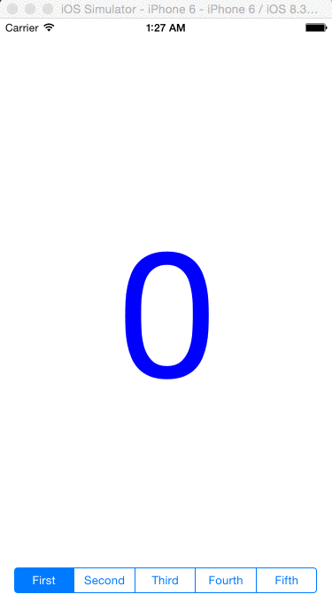

# HKLSegmentedControl
A subclass of UISegmentedControl which supports dynamically value changing.

HKLSegmentedControl is a fully compatible class with UISegmentedControl.
In addition to that, it supports touch moving events.
The delegate method is called each time when you swipe on the control.

